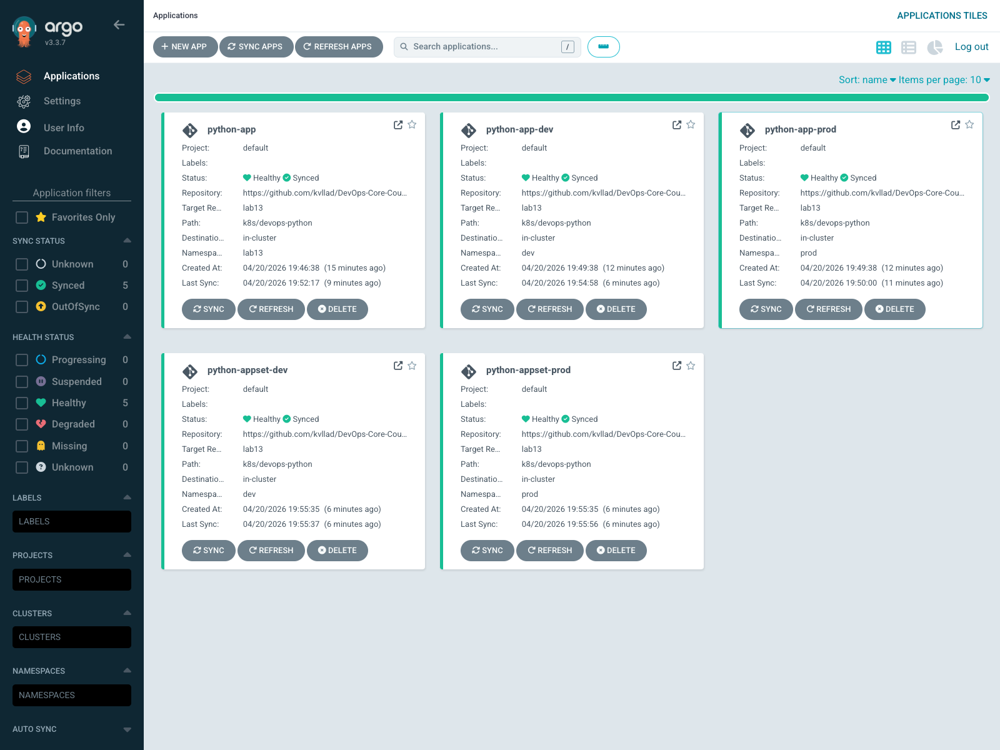
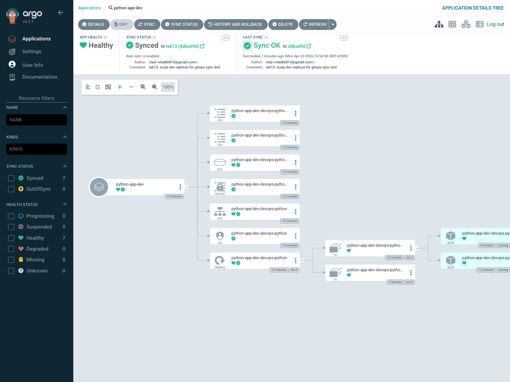

# Lab 13 — GitOps with ArgoCD

Execution date: 2026-04-20  
Cluster context: `kind-devops-labs`

## ArgoCD Setup

ArgoCD was installed via the official Helm chart into the `argocd` namespace. The setup includes:

- `argocd-server` for the web UI and API
- `argocd-repo-server` for Git and Helm rendering
- `argocd-application-controller` for reconciliation
- `argocd-applicationset-controller` for ApplicationSet generation
- `argocd-dex-server` and `argocd-redis`

UI access method:

```bash
kubectl port-forward svc/argocd-server -n argocd 8080:80
```

CLI login:

```bash
argocd login dummy --core
```

Installation verification:

```bash
$ kubectl get pods -n argocd -o wide
NAME                                                READY   STATUS    RESTARTS   AGE   IP           NODE
argocd-application-controller-0                     1/1     Running   0          15m   10.244.1.9   devops-labs-worker
argocd-applicationset-controller-55f6c9b87f-n44q8   1/1     Running   0          15m   10.244.1.6   devops-labs-worker
argocd-dex-server-5b8f8f64ff-khmkc                  1/1     Running   0          15m   10.244.1.4   devops-labs-worker
argocd-notifications-controller-5547448775-pv26h    1/1     Running   0          15m   10.244.1.8   devops-labs-worker
argocd-redis-dc6b586fc-nr9vc                        1/1     Running   0          15m   10.244.1.5   devops-labs-worker
argocd-repo-server-6f8f987df7-k5xdf                 1/1     Running   0          15m   10.244.1.3   devops-labs-worker
argocd-server-68bdd4bd96-7g9f9                      1/1     Running   0          15m   10.244.1.7   devops-labs-worker
```

Admin password retrieval:

```bash
$ kubectl get secret argocd-initial-admin-secret -n argocd -o jsonpath='{.data.password}' | base64 -d
<retrieved successfully>
```

CLI verification was done in core mode because the local port-forwarded gRPC path was unstable with this toolchain combination, while the Kubernetes API path remained fully functional:

```bash
$ argocd login dummy --core
Context 'kubernetes' updated

$ argocd app list --core
NAME                 SYNC STATUS   HEALTH STATUS
python-app           Synced        Healthy
python-app-dev       Synced        Healthy
python-app-prod      Synced        Healthy
python-appset-dev    Synced        Healthy
python-appset-prod   Synced        Healthy
```

## Application Configuration

Manifests:

- `k8s/argocd/application.yaml` — initial manual-sync application into namespace `lab13`
- `k8s/argocd/application-dev.yaml` — dev environment with auto-sync, prune, and self-heal
- `k8s/argocd/application-prod.yaml` — prod environment with manual sync
- `k8s/argocd/applicationset.yaml` — bonus ApplicationSet list generator for dev and prod

Source configuration:

- `repoURL`: `https://github.com/kvllad/DevOps-Core-Course.git`
- `targetRevision`: `lab13`
- `path`: `k8s/devops-python`

Environment value files:

- dev: `values-dev.yaml`
- prod: `values-prod.yaml`

Initial manual application deployment:

```bash
$ kubectl apply -f k8s/argocd/application.yaml
application.argoproj.io/python-app created

$ argocd app sync python-app --core
$ argocd app wait python-app --core --health --sync --timeout 300

$ kubectl get deploy,pods,svc,pvc -n lab13
NAME                                       READY   UP-TO-DATE   AVAILABLE   AGE
deployment.apps/python-app-devops-python   2/2     2            2           11m

NAME                                            READY   STATUS    RESTARTS   AGE
pod/python-app-devops-python-5797fcb7df-4whw9   1/1     Running   0          7m27s
pod/python-app-devops-python-5797fcb7df-sqxfn   1/1     Running   0          11m

NAME                               TYPE        CLUSTER-IP      EXTERNAL-IP   PORT(S)   AGE
service/python-app-devops-python   ClusterIP   10.96.218.238   <none>        80/TCP    11m

NAME                                                  STATUS   VOLUME                                     CAPACITY   ACCESS MODES   STORAGECLASS
persistentvolumeclaim/python-app-devops-python-data   Bound    pvc-99a1fb82-8a59-45b2-9101-8ef95935fcce   100Mi      RWO            standard
```

## Multi-Environment

`dev` and `prod` deploy the same Helm chart with different values:

- dev uses lower resource requests/limits and auto-sync
- prod uses higher resource requests/limits and manual sync
- namespaces stay isolated, so resources and PVCs do not overlap

Why prod stays manual:

- change review happens before production rollout
- release timing stays controlled
- the operator can inspect the diff before syncing

Environment verification:

```bash
$ kubectl get applications.argoproj.io -n argocd
NAME                 SYNC STATUS   HEALTH STATUS
python-app           Synced        Healthy
python-app-dev       Synced        Healthy
python-app-prod      Synced        Healthy
python-appset-dev    Synced        Healthy
python-appset-prod   Synced        Healthy

$ kubectl get application -n argocd python-app-dev -o jsonpath='{.spec.syncPolicy.automated.prune},{.spec.syncPolicy.automated.selfHeal}'
true,true

$ kubectl get application -n argocd python-app-prod -o jsonpath='{.spec.syncPolicy.automated.prune},{.spec.syncPolicy.automated.selfHeal}'
,
```

Live resource state:

```bash
$ kubectl get deploy,pods,svc,pvc -n dev
NAME                                              READY   UP-TO-DATE   AVAILABLE   AGE
deployment.apps/python-app-dev-devops-python      2/2     2            2           10m

NAME                                                   READY   STATUS    RESTARTS   AGE
pod/python-app-dev-devops-python-c7c6cd5cb-7v7fj       1/1     Running   0          7m26s
pod/python-app-dev-devops-python-c7c6cd5cb-9fq7h       1/1     Running   0          10m

NAME                                      TYPE        CLUSTER-IP    EXTERNAL-IP   PORT(S)   AGE
service/python-app-dev-devops-python      ClusterIP   10.96.92.94   <none>        80/TCP    10m

NAME                                                         STATUS   VOLUME                                     CAPACITY   ACCESS MODES   STORAGECLASS
persistentvolumeclaim/python-app-dev-devops-python-data      Bound    pvc-520fa55b-45b5-4d0e-b9ad-e975abedb03e   100Mi      RWO            standard

$ kubectl get deploy,pods,svc,pvc -n prod
NAME                                               READY   UP-TO-DATE   AVAILABLE   AGE
deployment.apps/python-app-prod-devops-python      3/3     3            3           9m44s

NAME                                                    READY   STATUS    RESTARTS   AGE
pod/python-app-prod-devops-python-6dfd69c748-7hxf7      1/1     Running   0          9m44s
pod/python-app-prod-devops-python-6dfd69c748-crqpn      1/1     Running   0          9m44s
pod/python-app-prod-devops-python-6dfd69c748-xgx26      1/1     Running   0          9m44s

NAME                                       TYPE        CLUSTER-IP     EXTERNAL-IP   PORT(S)   AGE
service/python-app-prod-devops-python      ClusterIP   10.96.35.181   <none>        80/TCP    9m44s

NAME                                                          STATUS   VOLUME                                     CAPACITY   ACCESS MODES   STORAGECLASS
persistentvolumeclaim/python-app-prod-devops-python-data      Bound    pvc-6d5c59d2-faab-4d4a-8486-3ae0401a912c   100Mi      RWO            standard
```

GitOps workflow test:

- Commit `83e6d64` removed legacy Helm hooks so ArgoCD could manage the chart cleanly.
- Commit `ddbad9d` changed `values-dev.yaml` `replicaCount` from `1` to `2`.
- `python-app-dev` auto-synced to revision `ddbad9d`.
- `python-app` pointed at the same values file but stayed under manual policy until explicitly synced.

## Self-Healing Evidence

Manual scale drift test:

```bash
$ kubectl scale deployment python-app-dev-devops-python -n dev --replicas=5

scale_test_start=2026-04-20T16:53:06Z
before_spec=2 before_ready=2
after_manual_scale=5
scale_self_healed_at=2026-04-20T16:53:08Z spec=2 ready=2
```

Pod deletion test:

```bash
pod_delete_start=2026-04-20T16:53:08Z old_pod=python-app-dev-devops-python-c7c6cd5cb-7gfpv
pod_recreated_at=2026-04-20T16:53:39Z new_pod=python-app-dev-devops-python-c7c6cd5cb-7v7fj
```

Configuration drift test:

```bash
resource_drift_start=2026-04-20T16:54:58Z
patched_cpu_request=75m
resource_self_healed_at=2026-04-20T16:55:00Z cpu_request=50m
final_cpu_request=50m
```

Sync behavior summary:

- Kubernetes heals missing pods because the workload controller keeps the desired replica count.
- ArgoCD heals configuration drift when the live object no longer matches Git and `selfHeal` is enabled.
- ArgoCD polls Git on a roughly 3 minute interval by default, unless sync is triggered manually or via webhook.
- For the Git change test I forced immediate refresh with `argocd.argoproj.io/refresh=hard` to avoid waiting for the default poll interval.

## Screenshots

Applications overview with individual apps and ApplicationSet-generated apps:



Application details view for the auto-sync dev app:



## Bonus — ApplicationSet

The bonus implementation uses a List generator to produce dev and prod Applications from one template. The template varies:

- application name
- namespace
- Helm values file
- release name
- auto-sync policy

Generated applications:

- `python-appset-dev`
- `python-appset-prod`

Validation result:

```bash
$ kubectl get applications.argoproj.io -n argocd
NAME                 SYNC STATUS   HEALTH STATUS
python-app           Synced        Healthy
python-app-dev       Synced        Healthy
python-app-prod      Synced        Healthy
python-appset-dev    Synced        Healthy
python-appset-prod   Synced        Healthy
```

This pattern scales better than hand-writing one Application per environment when:

- the repo contains many similar environments
- naming and sync policy follow a fixed pattern
- you want one source of truth for the app definition

For this lab I kept the task-required individual Applications and validated the ApplicationSet with separate generated app names in parallel. That avoided destroying the already verified task resources while still demonstrating the generator pattern end-to-end.

Individual Applications remain useful when:

- environments need materially different spec structure
- per-environment review and ownership are separate
- you do not want generator-driven updates
