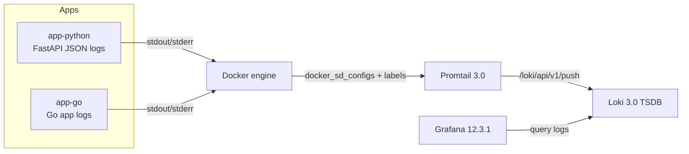
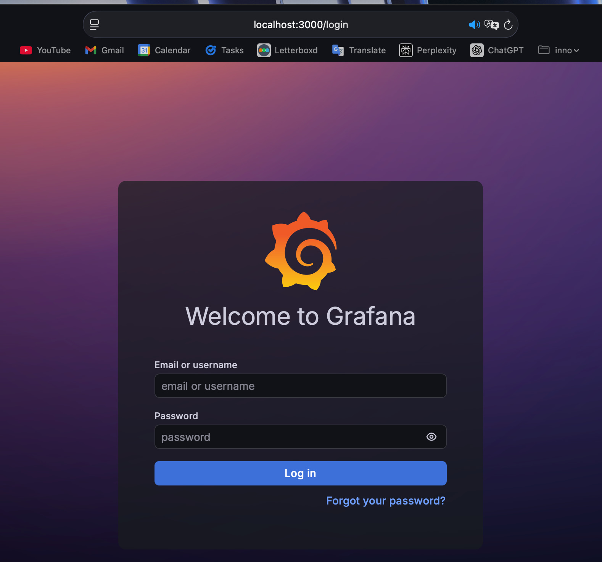
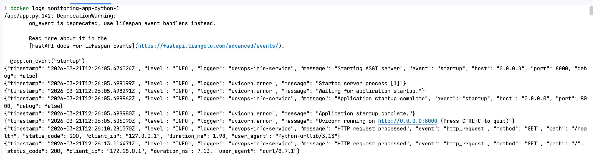
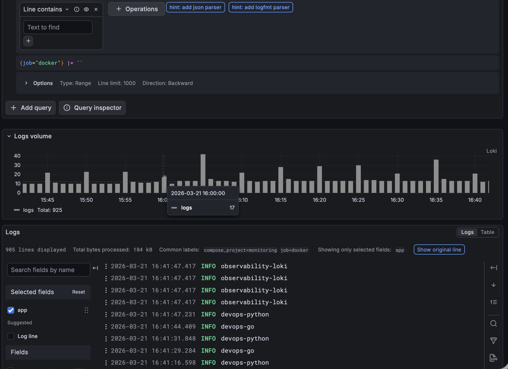
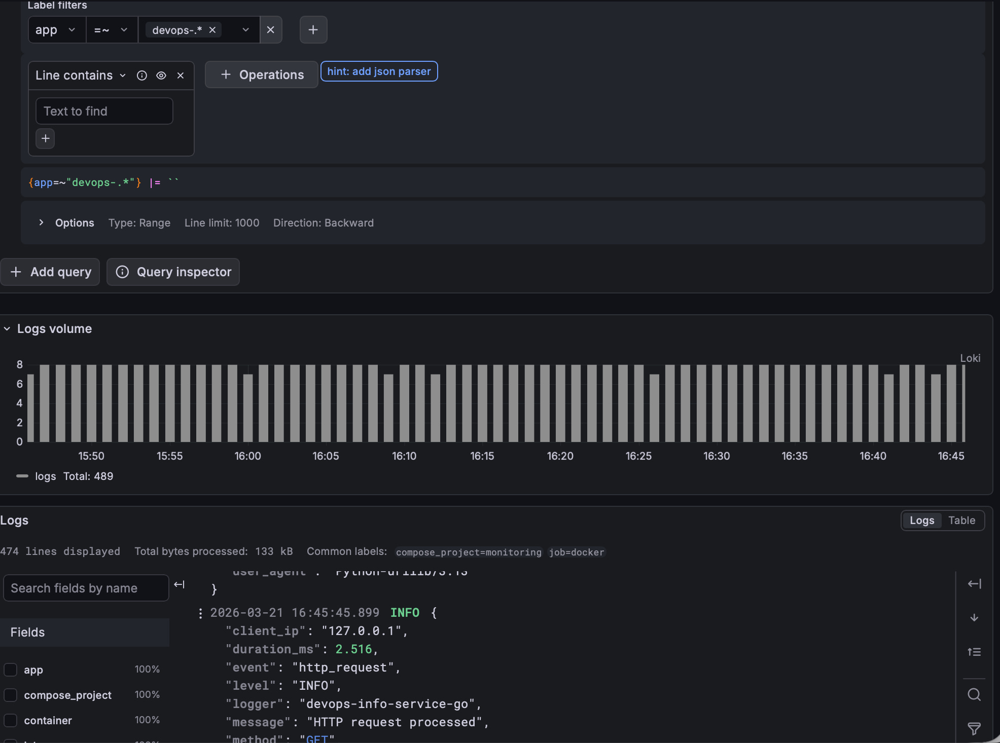
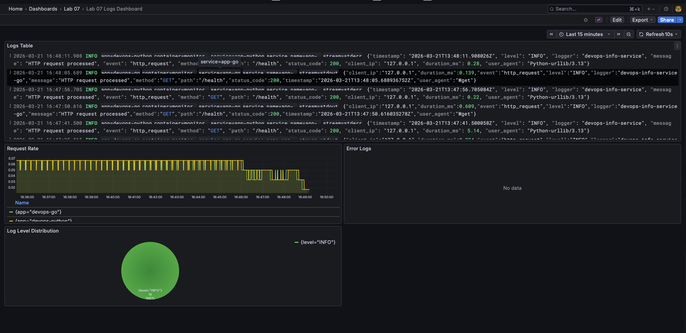

# Lab 7 — Observability & Logging with Loki Stack

## Architecture



## Setup Guide

1. Start the stack:

   ```bash
   cd monitoring
   docker compose up -d --build
   ```

2. Check status:

   ```bash
   docker compose ps
   curl http://localhost:3100/ready
   curl http://localhost:9080/targets
   curl http://localhost:3000/api/health
   ```

3. Open Grafana at `http://localhost:3000` and sign in with the values from `monitoring/.env`.

4. Generate traffic for both apps:

   ```bash
   for i in {1..20}; do curl -s http://localhost:8000/ > /dev/null; done
   for i in {1..20}; do curl -s http://localhost:8000/health > /dev/null; done
   for i in {1..20}; do curl -s http://localhost:8001/ > /dev/null; done
   for i in {1..20}; do curl -s http://localhost:8001/health > /dev/null; done
   for i in {1..5}; do curl -s http://localhost:8000/error-test > /dev/null; done
   ```

### Access Screens

Grafana login page:



## Configuration

### Loki

- `monitoring/loki/config.yml` uses single-node Loki 3.0 with `schema: v13`.
- Storage backend is `tsdb` with local filesystem storage under `/loki`.
- Retention is enforced for `168h` through `limits_config.retention_period` and `compactor.retention_enabled`.
- `common.storage.filesystem` keeps chunks and rule data in a single persistent volume for a lab-friendly deployment.

Snippet:

```yaml
schema_config:
  configs:
    - from: 2024-01-01
      store: tsdb
      object_store: filesystem
      schema: v13
```

### Promtail

- `docker_sd_configs` discovers containers from the Docker socket.
- Label filter keeps only containers marked with `logging=promtail`.
- Relabeling promotes Docker metadata into Loki labels: `container`, `app`, `service`, `compose_project`, `stream`.
- `pipeline_stages.docker` parses Docker JSON log envelopes before shipping them to Loki.

Snippet:

```yaml
docker_sd_configs:
  - host: unix:///var/run/docker.sock
    filters:
      - name: label
        values: [logging=promtail]
```

### Docker Compose

- The stack includes Loki, Promtail, Grafana, `app-python`, and `app-go`.
- Loki, Promtail, and Grafana are also labeled with `logging=promtail` so Grafana Explore can demonstrate logs from at least 3 containers while app-focused queries still filter on `app=~"devops-.*"`.
- Grafana has anonymous access disabled and reads admin credentials from `monitoring/.env`.
- Resource constraints and health checks are defined for every service.
- Grafana provisioning files auto-create the Loki data source and the log dashboard.

## Application Logging

`app_python/app.py` now emits structured JSON logs via a custom `JSONFormatter`.
`app_go/main.go` also emits JSON startup/request logs so the shared LogQL dashboard queries work across both applications.

Logged events:

- app startup
- every HTTP request with `method`, `path`, `status_code`, `client_ip`, `duration_ms`
- unhandled exceptions with stack traces
- test failures via `GET /error-test` to populate the error dashboard panel

Example:

```json
{"timestamp":"2026-03-21T00:00:00Z","level":"INFO","logger":"devops-info-service","message":"HTTP request processed","event":"http_request","method":"GET","path":"/health","status_code":200,"client_ip":"127.0.0.1","duration_ms":1.02}
```

Python application JSON logs:



## Dashboard

The dashboard is provisioned from `monitoring/grafana/dashboards/lab07-logs-dashboard.json`.

Panels:

1. `Logs Table`
   Query: `{app=~"devops-.*"}`
2. `Request Rate`
   Query: `sum by (app) (rate({app=~"devops-.*"}[1m]))`
3. `Error Logs`
   Query: `{app=~"devops-.*"} | json | __error__="" | level="ERROR"`
4. `Log Level Distribution`
   Query: `sum by (level) (count_over_time({app=~"devops-.*"} | json | __error__="" [5m]))`

Additional useful Explore queries:

- `{app="devops-python"}`
- `{app="devops-go"}`
- `{app="devops-python"} | json | __error__="" | method="GET"`

Grafana Explore with Docker logs from multiple containers:



Grafana Explore with application logs:



Provisioned dashboard:



## Production Config

- Anonymous Grafana access is disabled.
- Admin credentials are kept in `monitoring/.env`, while `monitoring/.env.example` is safe to commit.
- Named volumes persist Loki and Grafana data.
- Retention is limited to 7 days.
- Compose includes CPU and memory reservations/limits plus health checks for all services.

## Testing

Core verification commands:

```bash
cd monitoring
docker compose config
docker compose up -d --build
docker compose ps
docker compose logs app-python --tail=20
curl http://localhost:3100/ready
curl http://localhost:9080/targets
curl http://localhost:3000/api/health
curl http://localhost:8000/health
curl http://localhost:8001/health
```

Grafana API verification:

```bash
curl -u admin:<password> http://localhost:3000/api/datasources
curl -u admin:<password> http://localhost:3000/api/search
```

## Challenges

1. The lab mixes Grafana 11 and 12 references.
   Solution: standardized on `grafana/grafana:12.3.1` to match the task requirements and top-level stack specification.

2. Manual dashboard setup would make the lab hard to reproduce.
   Solution: provisioned both the Loki data source and dashboard from files so the environment is deterministic.

3. Production-style auth conflicts with quick lab testing.
   Solution: kept the stack secure by default while still using a local `.env` file for simple, explicit credentials.

## Evidence

Included screenshots:

- Grafana login page
- Python application JSON logs
- Grafana Explore with Docker logs from multiple containers
- Grafana Explore with logs from both applications
- Grafana dashboard

CLI verification artifacts are stored in `monitoring/docs/evidence/`.
