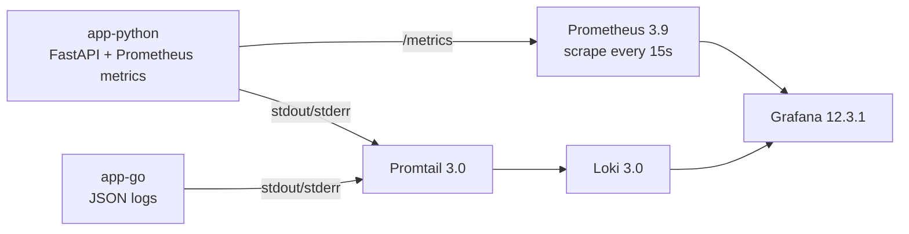
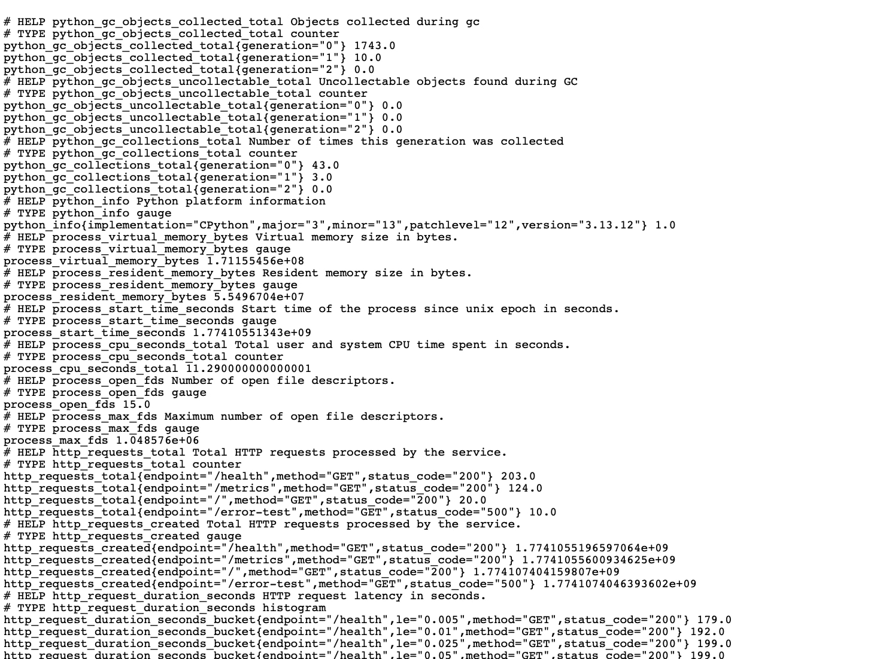
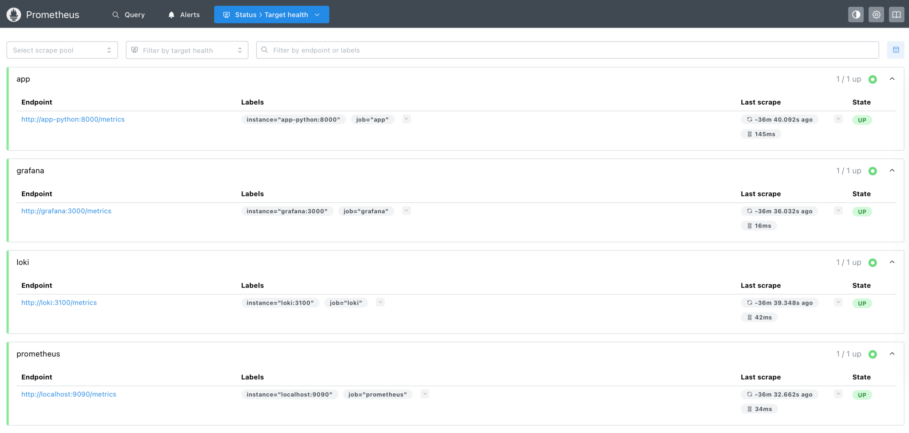
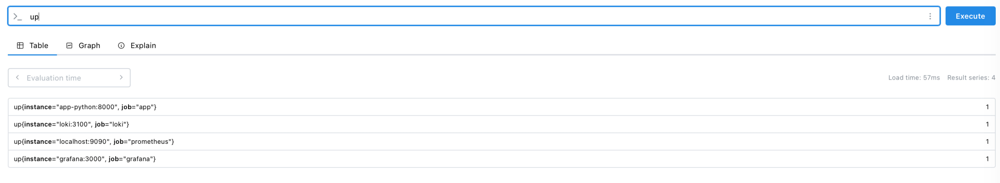
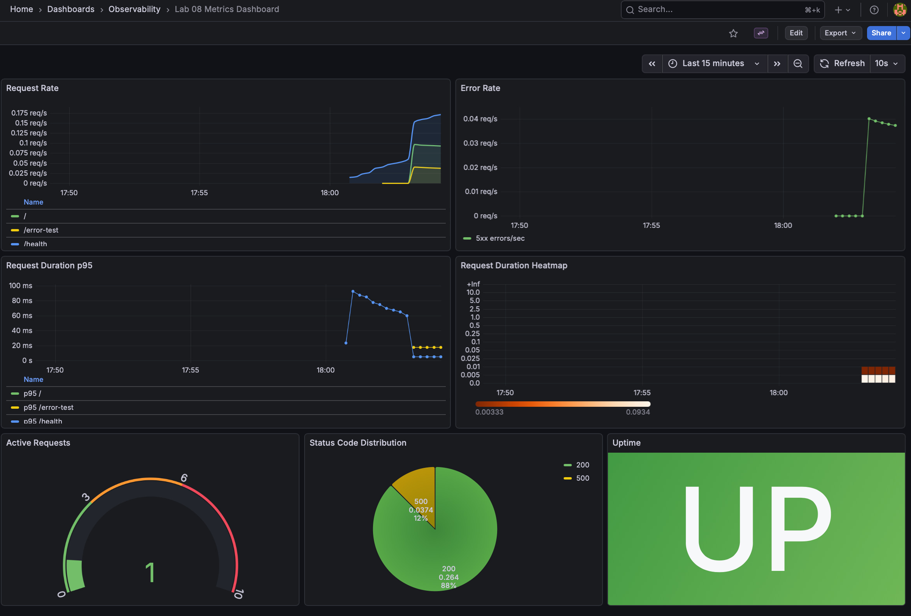

# Lab 8 — Metrics & Monitoring with Prometheus

## Architecture

The monitoring stack extends Lab 7 and keeps logs and metrics in one environment:

- `app-python` exposes Prometheus metrics on `/metrics`
- `prometheus` scrapes `app-python`, `loki`, `grafana`, and itself
- `grafana` provisions both Loki and Prometheus data sources
- two dashboards are provisioned automatically:
  - `Lab 07 Logs Dashboard`
  - `Lab 08 Metrics Dashboard`

## Application Instrumentation

The Python app is instrumented in [app.py](/Users/vladkuznetsov/inno/DevOps-Core-Course/app_python/app.py).

Added metric families:

1. `http_requests_total{method,endpoint,status_code}`
   Counts all HTTP requests and supports request rate and error rate queries.
2. `http_request_duration_seconds{method,endpoint,status_code}`
   Histogram used for latency distribution and p95 calculations.
3. `http_requests_in_progress`
   Gauge for concurrent in-flight requests.
4. `devops_info_endpoint_calls_total{endpoint}`
   Application-specific counter for endpoint usage.
5. `devops_info_system_info_collection_seconds`
   Histogram for the time spent collecting system data on `/`.

Implementation choices:

- endpoint labels are normalized from FastAPI route paths to keep cardinality low
- `/metrics` is exposed as `PlainTextResponse` using `generate_latest()`
- middleware records RED metrics for every request
- `/error-test` intentionally produces `500` responses to populate error panels
- `uvicorn.run(app, ...)` is used to avoid double-import and duplicate Prometheus collectors

Metrics endpoint evidence:

- `monitoring/docs/evidence/lab08-metrics-endpoint.txt`

Screenshot:

## Prometheus Configuration

Prometheus config lives in [prometheus.yml](/Users/vladkuznetsov/inno/DevOps-Core-Course/monitoring/prometheus/prometheus.yml).

Configuration summary:

- scrape interval: `15s`
- evaluation interval: `15s`
- retention: `15d`
- retention size cap: `10GB`
- scrape targets:
  - `prometheus` -> `localhost:9090`
  - `app` -> `app-python:8000/metrics`
  - `loki` -> `loki:3100/metrics`
  - `grafana` -> `grafana:3000/metrics`

Docker Compose adds:

- `prom/prometheus:v3.9.0`
- persistent volume `prometheus-data`
- health check on `/-/healthy`
- resource limit `1 CPU / 1G RAM`

Verified evidence:

- `monitoring/docs/evidence/lab08-prometheus-targets.json`
- `monitoring/docs/evidence/lab08-prometheus-query-up.json`

Prometheus targets:

Prometheus query `up`:

## Dashboard Walkthrough

The metrics dashboard is provisioned from [lab08-metrics-dashboard.json](/Users/vladkuznetsov/inno/DevOps-Core-Course/monitoring/grafana/dashboards/lab08-metrics-dashboard.json).

Panels:

1. `Request Rate`
   Query: `sum by (endpoint) (rate(http_requests_total{endpoint!="/metrics"}[5m]))`
   Shows request throughput per endpoint.

2. `Error Rate`
   Query: `sum(rate(http_requests_total{status_code=~"5..",endpoint!="/metrics"}[5m]))`
   Shows 5xx requests per second.

3. `Request Duration p95`
   Query: `histogram_quantile(0.95, sum by (le, endpoint) (rate(http_request_duration_seconds_bucket{endpoint!="/metrics"}[5m])))`
   Shows p95 latency by endpoint.

4. `Request Duration Heatmap`
   Query: `sum by (le) (rate(http_request_duration_seconds_bucket{endpoint="/"}[5m]))`
   Visualizes latency bucket distribution for the main endpoint.

5. `Active Requests`
   Query: `http_requests_in_progress`
   Shows current in-flight request count.

6. `Status Code Distribution`
   Query: `sum by (status_code) (rate(http_requests_total{endpoint!="/metrics"}[5m]))`
   Splits 2xx vs 5xx traffic.

7. `Uptime`
   Query: `up{job="app"}`
   Returns `1` when the app is reachable by Prometheus.

Grafana provisioning evidence:

- `monitoring/docs/evidence/lab08-grafana-datasources.json`
- `monitoring/docs/evidence/lab08-grafana-search-before-restart.json`

## PromQL Examples

1. `up`
   Quick reachability check for every scrape target.

2. `sum by (endpoint) (rate(http_requests_total{endpoint!="/metrics"}[5m]))`
   Request rate per endpoint.

3. `sum(rate(http_requests_total{status_code=~"5..",endpoint!="/metrics"}[5m]))`
   Error rate for failed requests only.

4. `histogram_quantile(0.95, sum by (le, endpoint) (rate(http_request_duration_seconds_bucket{endpoint!="/metrics"}[5m])))`
   p95 latency by endpoint.

5. `sum by (status_code) (rate(http_requests_total{endpoint!="/metrics"}[5m]))`
   Status code mix for the service.

6. `http_requests_in_progress`
   Current concurrency level.

Saved query results:

- `monitoring/docs/evidence/lab08-prometheus-query-request-rate.json`
- `monitoring/docs/evidence/lab08-prometheus-query-error-rate.json`
- `monitoring/docs/evidence/lab08-prometheus-query-p95.json`
- `monitoring/docs/evidence/lab08-prometheus-query-status-distribution.json`

## Production Setup

The stack is hardened in [docker-compose.yml](/Users/vladkuznetsov/inno/DevOps-Core-Course/monitoring/docker-compose.yml).

Health checks:

- `loki` -> `/ready`
- `promtail` -> raw HTTP probe to `/ready`
- `prometheus` -> `/-/healthy`
- `grafana` -> `/api/health`
- `app-python` and `app-go` -> `/health`

Resource limits:

- `prometheus`: `1 CPU`, `1G`
- `loki`: `1 CPU`, `1G`
- `grafana`: `0.5 CPU`, `512M`
- `app-python`: `0.5 CPU`, `256M`
- `app-go`: `0.5 CPU`, `256M`
- `promtail`: `0.5 CPU`, `512M`

Persistence:

- `prometheus-data`
- `loki-data`
- `grafana-data`
- `promtail-positions`

Persistence proof:

- `monitoring/docs/evidence/lab08-compose-down.txt`
- `monitoring/docs/evidence/lab08-compose-up-after-down.txt`
- `monitoring/docs/evidence/lab08-docker-compose-ps-after-restart.txt`
- `monitoring/docs/evidence/lab08-grafana-search-after-restart.json`

## Testing Results

What was verified locally:

1. Python tests passed:
   `pytest` -> `4 passed`, coverage `89.47%`
2. Go app builds successfully:
   `GOCACHE=/tmp/go-build go build ./...`
3. Ansible playbook syntax is valid:
   `ansible-playbook -i ansible/inventory/hosts.ini ansible/playbooks/deploy-monitoring.yml --syntax-check`
4. `docker compose up -d --build` brings all 6 services to `healthy`
5. Prometheus sees all four scrape targets in `health="up"`
6. Grafana auto-loads two datasources and both dashboards
7. Dashboards remain available after `docker compose down` and `up -d`

Metrics vs logs:

- metrics answer volume, rate, latency, and error-ratio questions quickly
- logs answer why a request failed and what exact event happened
- together they provide both fast detection and detailed diagnosis

CLI evidence is stored in:

- [evidence](/Users/vladkuznetsov/inno/DevOps-Core-Course/monitoring/docs/evidence)

Dashboard screenshot:

## Challenges & Solutions

1. Prometheus collectors were duplicated on app startup.
   Cause: `uvicorn.run("app:app")` imports the module a second time.
   Fix: switched to `uvicorn.run(app, ...)`.

2. `promtail` stayed `unhealthy` even though it was running.
   Cause: health check searched for lowercase `ready`, but the endpoint returns `200 OK` and `Ready`.
   Fix: changed the probe to match `200 OK`.

3. Docker build contexts became larger than necessary after creating a local virtualenv.
   Fix: added `.dockerignore` files for Python and Go apps.

4. Lab 8 adds metrics without replacing Lab 7 logging.
   Fix: kept Loki/Promtail/Grafana log provisioning intact and added Prometheus alongside it, so both observability flows work together.

## Bonus — Ansible Automation

The `monitoring` role was extended to deploy the full observability stack.

Updated role capabilities:

- copies application sources to the remote host for Compose-based image builds
- renders Loki, Promtail, Prometheus, Grafana datasource, and dashboard configs
- provisions both dashboards automatically
- deploys the stack with one playbook:
  - [deploy-monitoring.yml](/Users/vladkuznetsov/inno/DevOps-Core-Course/ansible/playbooks/deploy-monitoring.yml)

Relevant bonus files:

- [defaults/main.yml](/Users/vladkuznetsov/inno/DevOps-Core-Course/ansible/roles/monitoring/defaults/main.yml)
- [tasks/setup.yml](/Users/vladkuznetsov/inno/DevOps-Core-Course/ansible/roles/monitoring/tasks/setup.yml)
- [tasks/deploy.yml](/Users/vladkuznetsov/inno/DevOps-Core-Course/ansible/roles/monitoring/tasks/deploy.yml)
- [templates/prometheus.yml.j2](/Users/vladkuznetsov/inno/DevOps-Core-Course/ansible/roles/monitoring/templates/prometheus.yml.j2)
- [templates/docker-compose.yml.j2](/Users/vladkuznetsov/inno/DevOps-Core-Course/ansible/roles/monitoring/templates/docker-compose.yml.j2)
- [templates/grafana-prometheus-datasource.yml.j2](/Users/vladkuznetsov/inno/DevOps-Core-Course/ansible/roles/monitoring/templates/grafana-prometheus-datasource.yml.j2)
- [templates/grafana-metrics-dashboard.json.j2](/Users/vladkuznetsov/inno/DevOps-Core-Course/ansible/roles/monitoring/templates/grafana-metrics-dashboard.json.j2)

Bonus verification completed locally:

- playbook syntax check passed
- rendered Compose/templates are valid by inspection and local parity with the working stack

Remote execution of the bonus playbook was not attempted in this turn because SSH reachability to the target host was not revalidated here.
